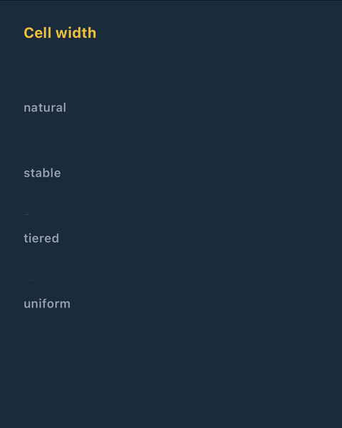
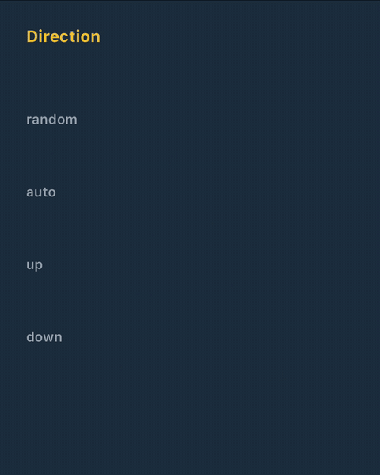

<div align="center">


# react-native-splitflap

**Split-flap departure-board text for React Native and Expo — every letter rolls, flips or flickers into place, played natively**

[](LICENSE)
[](https://www.npmjs.com/package/@enavermate/react-native-splitflap)
[](#-platforms)
[](#-platforms)
[](#-platforms)
[](#-platforms)
[](https://github.com/enavermate/react-native-splitflap/issues)
[](https://deepwiki.com/enavermate/react-native-splitflap)

</div>

<p align="center"><br /><sub>Emoji: <a href="https://github.com/jdecked/twemoji">Twemoji</a>, <a href="https://creativecommons.org/licenses/by/4.0/">CC-BY 4.0</a></sub></p>

---

## ✨ Features

- 🎰 **Four transitions** — `flip`, `reel`, `roll` and `scramble`, for words and for numbers
- 🔤 **Any text, any script** — Latin, Cyrillic, Greek, Armenian, Georgian, the Indic and
  Southeast Asian scripts, the kana and many numeral systems roll through their own alphabets; any
  other character still changes, in one step. Flags, emoji and Indic syllables stay whole in one
  cell. See [Scripts](#-scripts)
- 📏 **Cells that keep still** — tabular digits by default, and two cell widths: text-like `natural`
  and `uniform`, a station board's fixed cells
- ⚡ **Native players** — Core Animation on iOS, a frame-driven Canvas on Android. JavaScript plans
  a transition once; it never runs per frame
- 🔁 **Interruptible** — a new text mid-flight continues from where every cell is, without a jump
- ⏳ **Loading built in** — random words spin while data loads, then the real text lands from
  whichever is showing; numbers load as digits, and `loadingLength` takes the range the text may
  come in
- ♿ **Accessible** — announced as text with its full value, and Reduce Motion honoured
- 🪶 **No dependencies** — `react` and `react-native` are its only peers: no Reanimated, no Skia
- 🎯 **Pixel-identical at rest** — a settled board draws every glyph where a `<Text>` with the same
  style draws it, including truncation to "…"

## 📦 Installation

**Expo**

```sh
npx expo install @enavermate/react-native-splitflap
```

**Bun**

```sh
bun add @enavermate/react-native-splitflap
```

**Yarn**

```sh
yarn add @enavermate/react-native-splitflap
```

**npm**

```sh
npm install @enavermate/react-native-splitflap
```

**pnpm**

```sh
pnpm add @enavermate/react-native-splitflap
```

In an Expo app, use a
[development build](https://docs.expo.dev/develop/development-builds/introduction/): the library
has native code, so it does not run in Expo Go. In a bare React Native app, run
`cd ios && pod install` after installing.

No config plugin, and no changes to `Info.plist`, `AndroidManifest.xml` or the `Podfile`: autolinking
links the native code, and the development build picks it up.

## 🚀 Quick start

```tsx
import { Splitflap } from '@enavermate/react-native-splitflap';

<Splitflap text={departure} style={{ fontSize: 32, fontWeight: '700' }} />;
```

`text` is the only prop a board needs. A new `text` turns in from the one on screen.

The defaults are the look we found best: `reel`, cells reflowing like text, tabular digits, and
every other cell coming from above while the rest come from below.

## 🎞️ Transitions

| `transition`       | What every changed letter does                                                                    |
| ------------------ | ------------------------------------------------------------------------------------------------- |
| `flip`             | Flips over in halves, like a departure board. Needs `surfaceColor`                                |
| `reel` _(default)_ | Spins through the alphabet between the old letter and the new one, like a slot machine reel       |
| `roll`             | Rolls through a few letters: its neighbours when the new one is close, random ones when it is far |
| `scramble`         | Flickers through random letters of its own script, then locks                                     |

### `flip` and `surfaceColor`

A flip turns each letter's halves like a board's flaps, and paints the flaps solid so the half they
cover never shows through. Pass the **background colour right under the text** — the card or the
screen the board sits on — and the flaps vanish into it, so only the letters turn.

```tsx
<Splitflap text={gate} transition="flip" surfaceColor={theme.card} />
```

TypeScript requires `surfaceColor` wherever the transition can be `flip`: a fixed `flip`, or a
transition chosen at run time.

## 📏 Cell width

<p align="center"></p>

| `cellWidth` | Behaviour                                                                                                             |
| ----------- | --------------------------------------------------------------------------------------------------------------------- |
| `natural`   | A cell moves from the old glyph's width to the new one's, as a `<Text>` reflows. `reel` and `roll` only               |
| `uniform`   | Every cell as wide as the alphabet's widest letter, each glyph centred — a station board. A word never moves sideways |

Each transition starts from its best look and takes only the settings it shows well:

| `transition`      | Without `cellWidth`            | `cellWidth` accepted  | `direction` |
| ----------------- | ------------------------------ | --------------------- | ----------- |
| `reel`, `roll`    | `natural`                      | `natural` · `uniform` | ✅          |
| `flip`            | each letter near its own width | `uniform`             | —           |
| `scramble`        | each letter near its own width | `uniform`             | —           |
| chosen at runtime | the transition's               | `uniform`             | —           |

```tsx
<Splitflap text={destination} transition="flip" surfaceColor="#111" cellWidth="uniform" />
<Splitflap text={status} />
```

`flip` and `scramble` show two glyphs in one cell at once — a flap over a half, a new letter every
few frames — so under `natural` the cell would reflow for each: the flaps reach into the neighbours
and the word jumps. Without a `cellWidth` they keep every letter near its own width instead: the
text's alphabets measured and sorted into narrow, regular and wide cells. A flip always falls and a
scramble does not travel, so neither takes a `direction`. TypeScript refuses those combinations; in
plain JavaScript `natural` falls back to the default. `stable` and `tiered`, the widths before 0.6,
are taken as the default too, so an app that still passes them keeps working.

Digits are tabular by default (`fontVariant: ['tabular-nums']`), so numbers keep their width in
every mode.

## 🧭 Direction

<p align="center"></p>

`reel` and `roll` only.

| `direction`          | Behaviour                                                                                                                  |
| -------------------- | -------------------------------------------------------------------------------------------------------------------------- |
| `random` _(default)_ | Every other cell comes from above and the rest from below; which of the two comes from above is picked anew on each change |
| `auto`               | Each cell rolls the way its letter lies in the alphabet                                                                    |
| `up` / `down`        | Every cell one way                                                                                                         |

```tsx
<Splitflap text={weekday} transition="roll" direction="auto" />
```

## ⚙️ Props

| Prop                | Type                                       | Default        |                                                                                                                                                                                                                                          |
| ------------------- | ------------------------------------------ | -------------- | ---------------------------------------------------------------------------------------------------------------------------------------------------------------------------------------------------------------------------------------- |
| `text`              | `string`                                   | —              | **Required.** What the board shows                                                                                                                                                                                                       |
| `transition`        | `'flip' \| 'reel' \| 'roll' \| 'scramble'` | `'reel'`       | See [Transitions](#️-transitions)                                                                                                                                                                                                         |
| `surfaceColor`      | `ColorValue`                               | —              | The background colour under the text. Required wherever `transition` can be `flip`                                                                                                                                                       |
| `cellWidth`         | `'natural' \| 'uniform'`                   | per transition | See [Cell width](#-cell-width)                                                                                                                                                                                                           |
| `direction`         | `'random' \| 'auto' \| 'up' \| 'down'`     | `'random'`     | See [Direction](#-direction)                                                                                                                                                                                                             |
| `duration`          | `number`                                   | `650`          | Milliseconds per cell; `flip` takes 1.6×                                                                                                                                                                                                 |
| `stagger`           | `number`                                   | `40`           | Milliseconds between consecutive changed cells                                                                                                                                                                                           |
| `staggerOrder`      | `'ltr' \| 'rtl' \| 'random'`               | `'ltr'`        | The order the cells start in                                                                                                                                                                                                             |
| `alphabet`          | `'auto' \| script name \| { letters }`     | `'auto'`       | The letters a cell travels through: `auto` takes each letter's script from the text; a script name (`'latin'`, `'cyrillic'`, `'devanagari'`…) also sets the loading words' script; `{ letters }` sets your own. See [Scripts](#-scripts) |
| `animateOnMount`    | `boolean`                                  | `true`         | `false` shows the first text — and the first after `contentKey` changes — at once                                                                                                                                                        |
| `contentKey`        | `string \| number`                         | —              | Replans even if `text` did not change: a recycled list row showing a new item                                                                                                                                                            |
| `loading`           | `boolean`                                  | `false`        | Loops random words of the text's script until it turns `false`                                                                                                                                                                           |
| `loadingLength`     | `number \| { min, max }`                   | —              | The loading words' length, in cells: a number for exactly that many (a count of known width), `{ min, max }` for lengths drawn from the range the real text may come in. Without it the words wander ±1 around the text's length         |
| `reduceMotion`      | `'system' \| 'always' \| 'never'`          | `'system'`     | `system` follows the device's Reduce Motion setting                                                                                                                                                                                      |
| `seed`              | `number`                                   | `1`            | Makes the random choices reproducible                                                                                                                                                                                                    |
| `onTransitionStart` | `({ text }) => void`                       | —              | A transition began to play                                                                                                                                                                                                               |
| `onTransitionEnd`   | `({ text, interrupted }) => void`          | —              | The board settled, or a newer text interrupted it                                                                                                                                                                                        |
| `style`             | `TextStyle`                                | —              | Font family, size, weight, style, variant, colour, letter spacing, line height — as on `<Text>`                                                                                                                                          |

Every `View` prop passes through. `accessibilityLabel` defaults to `text`.

## 📚 API reference

Everything the package exports, with every field. The table above is the short form of the first
part.

### `<Splitflap>` props in full

**`text: string`** — required. What the board shows. Split into cells as a reader sees characters:
a flag, a skin-toned or ZWJ emoji, a keycap, a letter with combining accents and an Indic or Thai
syllable each take one cell. One line; text wider than the container ends in `…`.

**`transition?: 'flip' | 'reel' | 'roll' | 'scramble'`** — default `'reel'`. How a changed cell
moves; see [Transitions](#️-transitions). A cell whose glyph did not change does not move.

**`surfaceColor?: ColorValue`** — the colour right under the text. `flip` paints its flaps with it,
so it is required by the types wherever the transition can be `flip` (a literal `'flip'`, or a
`SplitflapTransition` chosen at run time). Other transitions ignore it.

**`cellWidth?: 'natural' | 'uniform'`** — how wide each cell is, see
[Cell width](#-cell-width). Without it, `reel` and `roll` are `natural`, and `flip` and `scramble`
keep each letter near its own width. `flip`, `scramble` and a transition chosen at run time do not
accept `natural` (TypeScript refuses it; in plain JavaScript it falls back to the default).

**`direction?: 'random' | 'auto' | 'up' | 'down'`** — `reel` and `roll` only; default `'random'`.
`random`: every other cell comes from above and the rest from below, which half is picked anew on
each change. `auto`: each cell rolls the way its letter lies in the alphabet. `up` / `down`: every
cell one way. Not accepted with `flip` (it always falls), `scramble` (it does not travel) or a
transition chosen at run time.

**`duration?: number`** — default `650` (`DEFAULT_DURATION_MS`). Milliseconds one cell takes;
`flip` takes 1.6× this. A `reel` cell that travels far moves faster rather than longer.

**`stagger?: number`** — default `40` (`DEFAULT_STAGGER_MS`). Milliseconds between the starts of
consecutive changed cells; `0` starts them all together.

**`staggerOrder?: 'ltr' | 'rtl' | 'random'`** — default `'ltr'`. The order the changed cells start
in: left to right, right to left, or shuffled (reproducibly, by `seed`).

**`alphabet?: 'auto' | SplitflapScript | { letters: string }`** — default `'auto'`. The letters a
cell travels through. `auto`: each letter's own script, read from the text. A script name
(`'latin'`, `'cyrillic'`, `'greek'`, `'armenian'`, `'georgian'`, `'devanagari'`, `'bengali'`,
`'gurmukhi'`, `'gujarati'`, `'oriya'`, `'tamil'`, `'telugu'`, `'kannada'`, `'malayalam'`,
`'sinhala'`, `'thai'`, `'lao'`, `'tibetan'`, `'myanmar'`, `'khmer'`, `'hiragana'`, `'katakana'`):
the same, and the loading words — which have no text to read a script from — are in that script.
`{ letters: 'ABC…' }`: only these letters, in this order. A glyph in no alphabet changes in one
step.

**`loading?: boolean`** — default `false`. While `true`, the board loops random words of the text's
script (a new one every `LOADING_WORD_MS`, 430 ms); when it turns `false`, the real `text` lands
from whatever word is showing. A text with no letters — a count, a price, a time — loads as digits
of its own numeral system, and a text in capitals loads in capitals.

**`loadingLength?: number | { min: number; max: number }`** — the loading words' length, in cells.
A number: every word exactly that long (a count of known width). `{ min, max }`: each word's length
drawn from the range — the shortest and longest text the board is waiting for (ends taken in either
order, rounded down, never below 1). Without it the words wander ±1 around the text's length, or
around 6 when the text is empty.

**`animateOnMount?: boolean`** — default `true`. `false`: the first text appears at once, and so
does the first text after `contentKey` changes; later changes animate. For list rows that are
recycled.

**`contentKey?: string | number`** — replans when it changes even if `text` did not: a recycled
row now showing another item with the same label.

**`reduceMotion?: 'system' | 'always' | 'never'`** — default `'system'`. `system` follows the
device's Reduce Motion setting; `always` shows every change at once; `never` always animates.

**`seed?: number`** — default `1`. Seeds every random choice (scramble letters, random stagger,
the random direction, loading words), so the same seed plays the same way.

**`style?: StyleProp<TextStyle>`** — `fontFamily`, `fontSize`, `fontWeight`, `fontStyle`,
`fontVariant`, `color`, `letterSpacing` and `lineHeight` style the glyphs, as on `<Text>`; the
rest (margins, `alignSelf`, `opacity`…) styles the board's view. Digits are tabular by default
(`fontVariant: ['tabular-nums']`); any `fontVariant` you pass replaces that. Follows the system
font size (Dynamic Type / font scale).

**`onTransitionStart?: (event: { text: string }) => void`** — a change began to animate. Not called
when it shows at once (Reduce Motion, `animateOnMount={false}`).

**`onTransitionEnd?: (event: { text: string; interrupted: boolean }) => void`** — the board
settled on `text`; `interrupted: true` when a newer text took over before it did.

**View props** — every other `View` prop passes through (`testID`, `onLayout`, `pointerEvents`…).
The board is one accessible element with role `text`; `accessibilityLabel` defaults to `text`.

### Functions and constants

| Export                                      | Signature                                                                                        | What it is for                                                                                                                                      |
| ------------------------------------------- | ------------------------------------------------------------------------------------------------ | --------------------------------------------------------------------------------------------------------------------------------------------------- |
| `Splitflap`                                 | `(props: SplitflapProps) => ReactElement`                                                        | The board                                                                                                                                           |
| `isSplitflapNativeAvailable`                | `() => boolean`                                                                                  | `true` where the board plays natively (iOS and Android with the native view registered); elsewhere, on the web for one, it renders a plain `<Text>` |
| `createBoard`                               | `() => Board`                                                                                    | An empty board for the planner                                                                                                                      |
| `planTransition`                            | `(board: Board, input: TransitionInput) => { plan: Plan; board: Board }`                         | Plans a change of text: every cell's path, timing and direction. Retargets from wherever the cells are at `input.now`                               |
| `loadingPlan`                               | `(length: LoadingLength, seed: number, options: LoadingOptions) => { plan: Plan; board: Board }` | Plans the looping loading words                                                                                                                     |
| `DEFAULT_DURATION_MS`, `DEFAULT_STAGGER_MS` | `650`, `40`                                                                                      | The defaults of `duration` and `stagger`                                                                                                            |
| `LOADING_WORD_MS`, `LOADING_WORDS`          | `430`, `8`                                                                                       | How long each loading word shows, and how many words one loop holds                                                                                 |

The players run the plans the planner returns, so the planner is enough to test what a board will
do, or to draw a board some other way.

```ts
import {
  createBoard,
  planTransition,
} from '@enavermate/react-native-splitflap';

const { plan } = planTransition(createBoard(), {
  text: 'BERLIN',
  now: 0,
  transition: 'flip',
});
plan.totalMs; // when the board settles
```

### Types

| Type                                                           | Shape                                                                                                                                                                                                                                                                                                                                                                                                      |
| -------------------------------------------------------------- | ---------------------------------------------------------------------------------------------------------------------------------------------------------------------------------------------------------------------------------------------------------------------------------------------------------------------------------------------------------------------------------------------------------- |
| `SplitflapProps`                                               | The props above                                                                                                                                                                                                                                                                                                                                                                                            |
| `SplitflapTransition`                                          | `'flip' \| 'reel' \| 'roll' \| 'scramble'`                                                                                                                                                                                                                                                                                                                                                                 |
| `SplitflapCellWidth`, `SplitflapSteadyCellWidth`               | `'natural' \| 'uniform'`; the steady one without `'natural'`                                                                                                                                                                                                                                                                                                                                               |
| `Direction`, `StaggerOrder`                                    | `'random' \| 'auto' \| 'up' \| 'down'`; `'ltr' \| 'rtl' \| 'random'`                                                                                                                                                                                                                                                                                                                                       |
| `SplitflapScript`, `AlphabetOption`                            | The script names listed under `alphabet`; `'auto' \| SplitflapScript \| { letters: string }`                                                                                                                                                                                                                                                                                                               |
| `LoadingLength`                                                | `number \| { min: number; max: number }`                                                                                                                                                                                                                                                                                                                                                                   |
| `SplitflapTransitionStartEvent`, `SplitflapTransitionEndEvent` | `{ text }`; `{ text, interrupted }`                                                                                                                                                                                                                                                                                                                                                                        |
| `TransitionInput`                                              | `{ text; now; transition?; duration?; stagger?; staggerOrder?; direction?; alphabet?; seed?; instant? }` — `now` is the plan's start in your clock (the same clock for later retargets); `instant` settles every cell at once                                                                                                                                                                              |
| `LoadingOptions`                                               | `{ now; alphabet?; text?; wordMs?; transition?; exactLength? }` — `text` lends its script to the words; `exactLength` makes a number `length` exact instead of ±1                                                                                                                                                                                                                                          |
| `Plan`                                                         | `{ v: 1; transition; totalMs; cells: CellPlan[]; loop? }` — one change of the whole board; `loop` replays it (loading)                                                                                                                                                                                                                                                                                     |
| `CellPlan`                                                     | `{ i; from; to; path; land; delayMs; durationMs; easing; dir; stepMs?; letters?; resume? }` — cell `i` goes from `from` through `path` and settles on `path[land]` (= `to`; `''` is an empty cell) after `delayMs`, over `durationMs`; `dir` 1 = the new glyph comes from below; `letters`/`stepMs` are what a scramble flickers through and how often; `resume` continues a cell another plan interrupted |
| `Easing`                                                       | `'out' \| 'inOut' \| 'linear'`                                                                                                                                                                                                                                                                                                                                                                             |
| `Board`, `BoardCell`                                           | What the planner remembers between changes: `{ revision; cells: { cell: CellPlan; startMs; loopMs? }[] }`. Immutable; every call returns a new one                                                                                                                                                                                                                                                         |

## 📱 Platforms

|            | iOS            | Android                |
| ---------- | -------------- | ---------------------- |
| Status     | Stable         | Stable                 |
| Player     | Core Animation | Canvas, frame by frame |
| Minimum OS | iOS 15.1       | Android 7.0 (API 24)   |

**The New Architecture (Fabric) is required.**

### Tested with

| Expo SDK | React Native | iOS | Android |
| -------- | ------------ | --- | ------- |
| 57       | 0.86         | ✅  | ✅      |
| 56       | 0.85         | ✅  | ✅      |
| 55       | 0.83         | ✅  | ✅      |
| 54       | 0.81         | ✅  | ✅      |

Each is a fresh Expo app of that SDK with the package installed from the same tarball npm gets,
built in Release and run on the iOS 26 simulator and the Android 16 emulator: every transition,
the scripts, numbers and loading on one screen, checked on screenshots.

Both players take the same plan from the JavaScript planner: the same transitions, the same
timing, and a test that checks every Android cell is where the planner puts it at every instant.
On the web the board is a plain `<Text>`.

## 🍳 Recipes

**A counter that never jumps sideways**

```tsx
<Splitflap text={String(count)} transition="roll" />
```

**A list row that appears still and animates only on change**

```tsx
<Splitflap text={item.status} contentKey={item.id} animateOnMount={false} />
```

**A board that keeps its row of cells** — pad every text to the longest one, as a real board has a
fixed row of flaps, and nothing grows or shrinks between words

```tsx
const cells = Math.max(...cities.map((c) => c.length));

<Splitflap
  text={city.padEnd(cells)}
  transition="flip"
  surfaceColor={card}
  cellWidth="uniform"
/>;
```

**A station board**

```tsx
<Splitflap
  text={destination.toUpperCase()}
  transition="flip"
  surfaceColor="#111"
  cellWidth="uniform"
  style={{ color: '#f5c518', fontSize: 28, fontWeight: '700' }}
/>
```

**Waiting for data**

```tsx
<Splitflap text={price ?? ''} loading={price === undefined} loadingLength={4} />
```

**Waiting for a word of unknown length** — the loading words try on the sizes it may come in

```tsx
<Splitflap
  text={city ?? ''}
  loading={city === undefined}
  loadingLength={{ min: 4, max: 10 }}
/>
```

## 🔤 Scripts

A cell rolls through the alphabet of its own letter's script, read from the text — no language
setting. Each script has one alphabet for all its languages: a language's own letters stand next to
the letter they grew from (ґ after г, ђ after д, ł after l), and a word travels only through the
core letters and the extra letters it contains, so a Belarusian word never flashes ї and a Ukrainian
one never flashes ы.

| Script                                                                                     | Languages, for example                                                    |                            |
| ------------------------------------------------------------------------------------------ | ------------------------------------------------------------------------- | -------------------------- |
| Latin                                                                                      | English, Spanish, German, French, Polish, Turkish, Vietnamese…            | rolls                      |
| Cyrillic                                                                                   | Ukrainian, Belarusian, Bulgarian, Serbian, Macedonian, Kazakh, Mongolian… | rolls                      |
| Greek, Armenian, Georgian                                                                  |                                                                           | rolls                      |
| Devanagari, Bengali, Gurmukhi, Gujarati, Oriya, Tamil, Telugu, Kannada, Malayalam, Sinhala | Hindi, Marathi, Nepali, Bengali, Punjabi, Tamil…                          | rolls, a syllable per cell |
| Thai, Lao, Khmer, Myanmar, Tibetan                                                         |                                                                           | rolls, a syllable per cell |
| Hiragana, Katakana                                                                         | Japanese                                                                  | rolls                      |
| Digits                                                                                     | ASCII, Arabic-Indic, Persian, Indic, Thai, fullwidth…                     | rolls                      |
| Chinese and Japanese kanji, Korean Hangul, symbols, any other                              |                                                                           | changes in one step        |

An accented letter rolls as its base letter and lands as itself (é, ş, ά, ệ). Whatever the library
has no alphabet for changes in one step: a board never fails on an unknown script.

```tsx
<Splitflap text={code} alphabet={{ letters: '0123456789ABCDEF' }} />
```

## 🚫 Limitations

- Right-to-left scripts are not supported: Arabic letters change shape with their neighbours and
  cannot be split into cells, and Hebrew would read in the wrong order
- No web renderer yet

## 🍎 Also for Swift

The same board for native apps: [SplitflapKit](https://github.com/enavermate/SplitflapKit), a Swift
package for SwiftUI and UIKit on iPhone, iPad and the Mac (Mac Catalyst). Its planner is a line-by-line port of this
one, checked against the same plans, so a text animates the same way in both.

## 🤝 Contributing

Found a bug, or missing something? [Open an issue](https://github.com/enavermate/react-native-splitflap/issues/new/choose) —
a short reproduction helps the most. How issues, ideas and pull requests are handled is in
[CONTRIBUTING](CONTRIBUTING.md). Everyone taking part follows the [code of conduct](CODE_OF_CONDUCT.md).

## 📄 License

[MIT](LICENSE) © Roman Diukachov
